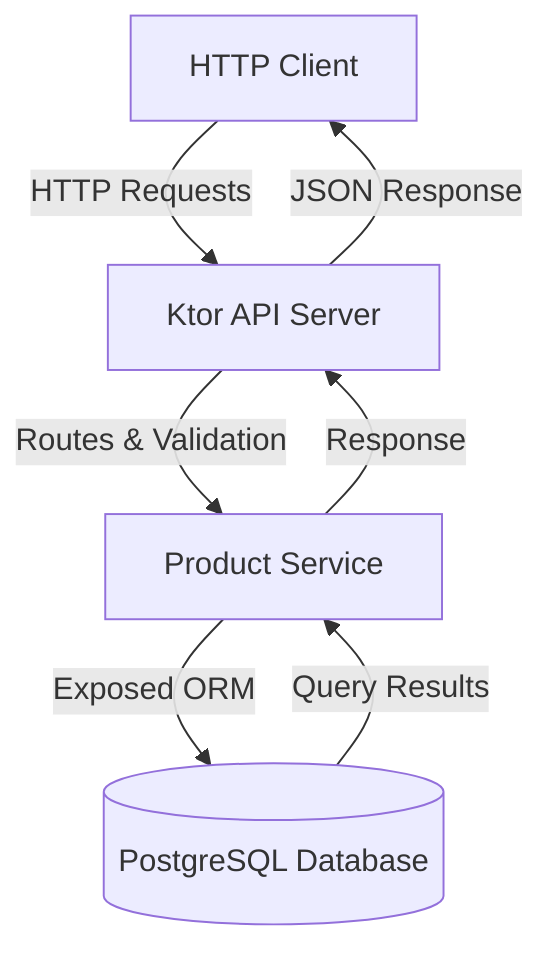
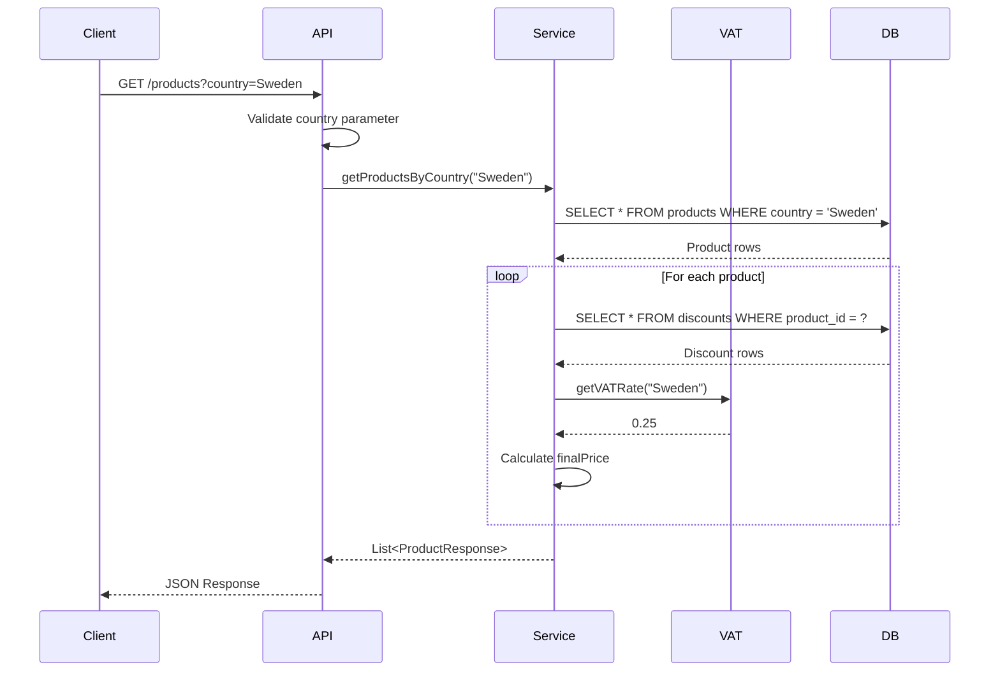
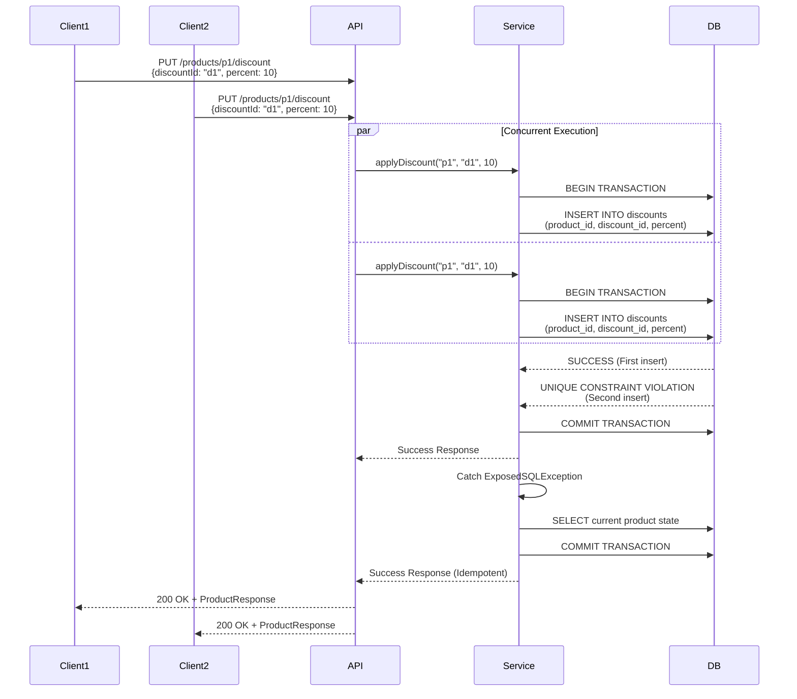
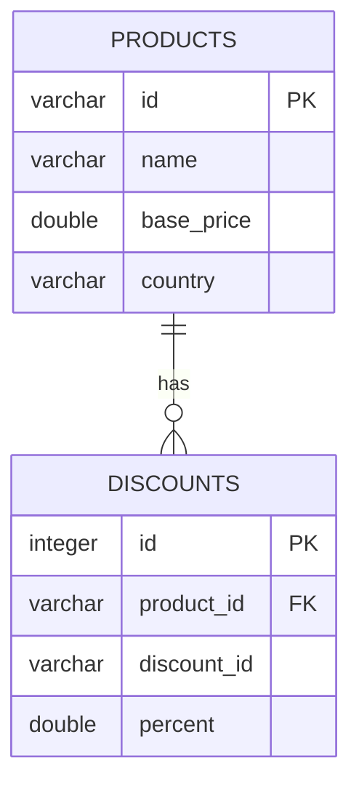
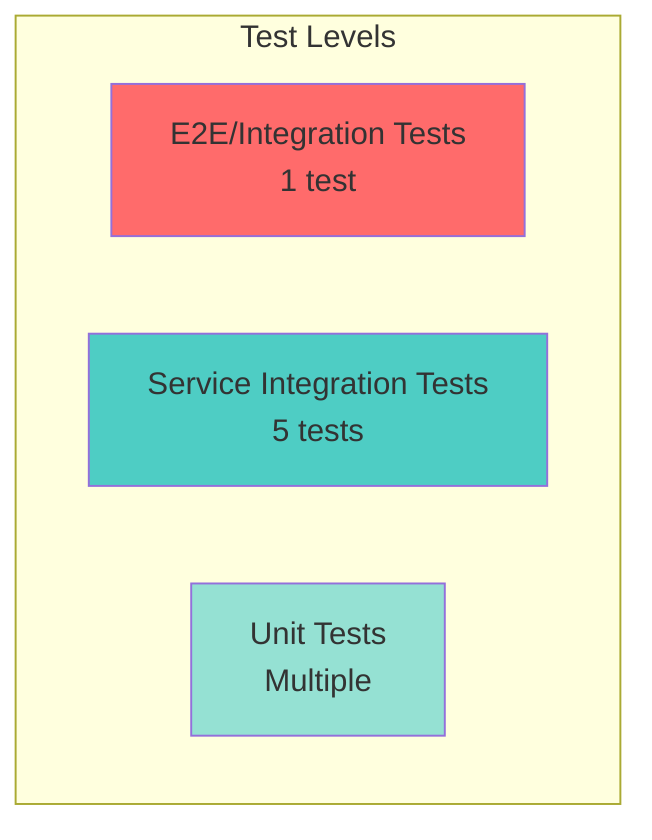
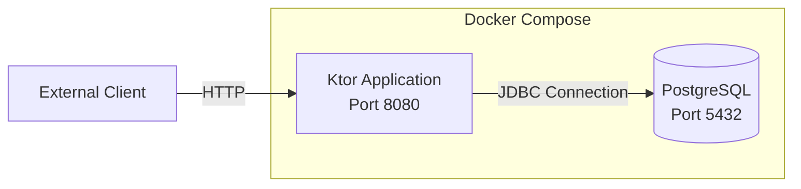

# Architecture Documentation

## Overview

This document describes the architecture, design decisions, and implementation details of the Elux Product API.

## System Architecture

### High-Level Components



### Technology Stack

| Layer | Technology | Purpose |
|-------|-----------|---------|
| API Framework | Ktor 2.3.6 | Lightweight, async HTTP server |
| Language | Kotlin 1.9.20 | Type-safe, concise JVM language |
| ORM | Exposed | Type-safe SQL DSL |
| Database | PostgreSQL 15 | ACID-compliant relational DB |
| Serialization | kotlinx.serialization | JSON handling |
| Connection Pool | HikariCP | High-performance DB connection pooling |
| Testing | Kotlin Test + H2 | Unit and integration testing |

## API Endpoints

### GET /products?country={country}

Returns all products for a specific country with calculated final prices.



**Formula:** 
```
finalPrice = basePrice × (1 - totalDiscount%) × (1 + VAT%)

Example:
- basePrice: 1000
- discounts: 10% + 5% = 15%
- VAT: 25% (Sweden)
- finalPrice: 1000 × (1 - 0.15) × (1 + 0.25) = 1000 × 0.85 × 1.25 = 1062.50
```

### PUT /products/{id}/discount

Applies a discount to a product with idempotency and concurrency safety.



## Concurrency Handling

### Database-Level Concurrency

The system ensures concurrency safety through PostgreSQL database constraints rather than application-level locking.

**Key Design Decision:** Use database unique constraints instead of:
- ❌ `ConcurrentHashMap` (in-memory, doesn't survive restarts)
- ❌ Application locks (doesn't scale across instances)
- ❌ Optimistic locking (requires version fields and retry logic)
- ✅ Database unique constraint (ACID-compliant, scalable)

### Unique Constraint

```sql
CREATE UNIQUE INDEX unique_product_discount 
ON discounts (product_id, discount_id);
```

This constraint ensures:
1. Same discount cannot be applied twice to the same product
2. Concurrent requests are serialized at database level
3. Transaction isolation prevents race conditions
4. Works across multiple application instances

### Transaction Isolation

- **Level**: `REPEATABLE_READ`
- **Purpose**: Prevents phantom reads and non-repeatable reads
- **Configuration**: Set in HikariCP connection pool

```kotlin
config.transactionIsolation = "TRANSACTION_REPEATABLE_READ"
```

### Idempotency Implementation

```kotlin
fun applyDiscount(productId: String, discountId: String, percent: Double): Result<ProductResponse> = transaction {
    try {
        // Try to insert discount
        Discounts.insert {
            it[productId] = productId
            it[discountId] = discountId
            it[percent] = percent
        }
        // Return success with updated product
        Result.success(buildProductResponse(productId))
    } catch (e: ExposedSQLException) {
        // Check for unique constraint violation
        if (e.message?.contains("UNIQUE") == true) {
            // Discount already exists - return current state (idempotent)
            Result.success(buildProductResponse(productId))
        } else {
            Result.failure(e)
        }
    }
}
```

**Benefits:**
- ✅ True idempotency: Same request multiple times = same result
- ✅ No application state required
- ✅ Safe with concurrent requests
- ✅ Works across application restarts
- ✅ Scales horizontally

## Data Model

### Entity Relationship



### Database Schema (Exposed DSL)

```kotlin
object Products : Table("products") {
    val id = varchar("id", 100)
    val name = varchar("name", 255)
    val basePrice = double("base_price")
    val country = varchar("country", 50)
    
    override val primaryKey = PrimaryKey(id)
}

object Discounts : Table("discounts") {
    val id = integer("id").autoIncrement()
    val productId = varchar("product_id", 100).references(Products.id)
    val discountId = varchar("discount_id", 100)
    val percent = double("percent")
    
    override val primaryKey = PrimaryKey(id)
    
    init {
        // Ensure discount can only be applied once per product
        uniqueIndex("unique_product_discount", productId, discountId)
    }
}
```

## VAT Calculation

### Supported Countries

| Country | VAT Rate |
|---------|----------|
| Sweden  | 25%      |
| Germany | 19%      |
| France  | 20%      |

### Implementation

```kotlin
object VATCalculator {
    private val vatRates = mapOf(
        "Sweden" to 0.25,
        "Germany" to 0.19,
        "France" to 0.20
    )
    
    fun calculateFinalPrice(basePrice: Double, totalDiscountPercent: Double, vatRate: Double): Double {
        val priceAfterDiscount = basePrice * (1 - totalDiscountPercent / 100.0)
        return priceAfterDiscount * (1 + vatRate)
    }
}
```

## Error Handling

### HTTP Status Codes

| Status | Condition |
|--------|-----------|
| 200 OK | Successful request |
| 400 Bad Request | Missing/invalid parameters |
| 404 Not Found | Product doesn't exist |
| 500 Internal Server Error | Unexpected error |

### Error Response Format

```json
{
  "error": "bad_request",
  "message": "Country parameter is required"
}
```

## Testing Strategy

### Test Pyramid



### Key Tests

1. **Unit Tests**
   - VAT calculation
   - Data model serialization
   
2. **Integration Tests**
   - Product listing by country
   - Discount application
   - Idempotency verification
   - Final price calculation

3. **Concurrency Test**
   - Simulates 10 concurrent PUT requests
   - Verifies discount applied exactly once
   - Uses H2 in-memory database
   - Tests database constraint effectiveness

```kotlin
@Test
fun testConcurrentDiscountApplication() {
    val numConcurrentRequests = 10
    
    runBlocking {
        val jobs = (1..numConcurrentRequests).map {
            async(Dispatchers.IO) {
                productService.applyDiscount("p3", "discount3", 20.0)
            }
        }
        
        val results = jobs.awaitAll()
        
        // All requests succeed (idempotent)
        results.forEach { result ->
            assertTrue(result.isSuccess)
        }
        
        // Discount applied exactly once
        val product = getProduct("p3")
        assertTrue(product.discounts.any { it.discountId == "discount3" })
    }
}
```

## Deployment

### Docker Architecture



### Environment Configuration

```yaml
services:
  postgres:
    image: postgres:15-alpine
    environment:
      POSTGRES_DB: elux_products
      POSTGRES_USER: elux_user
      POSTGRES_PASSWORD: elux_pass
    healthcheck:
      test: ["CMD-SHELL", "pg_isready"]
      interval: 10s

  app:
    build: .
    environment:
      DATABASE_URL: jdbc:postgresql://postgres:5432/elux_products
      DATABASE_USER: elux_user
      DATABASE_PASSWORD: elux_pass
    depends_on:
      postgres:
        condition: service_healthy
```

## Performance Considerations

### Connection Pooling

- **HikariCP**: Industry-standard high-performance connection pool
- **Max Pool Size**: 10 connections (configurable)
- **Transaction Isolation**: `REPEATABLE_READ` for data consistency

### Scalability

The architecture supports horizontal scaling:

1. **Stateless Application**: No session state in application
2. **Database Constraints**: Concurrency handled at DB level
3. **Connection Pooling**: Efficient database connection management
4. **Container-Ready**: Docker support for orchestration (Kubernetes, etc.)

### Optimization Opportunities

1. **Caching**: Add Redis for frequently accessed products
2. **Read Replicas**: Separate read/write database instances
3. **Indexing**: Add indexes on `country` column for faster queries
4. **Pagination**: Add pagination for large product lists

## Security Considerations

### Current Implementation

- ✅ Input validation (discount percent, country parameter)
- ✅ SQL injection prevention (Exposed ORM with parameterized queries)
- ✅ Transaction isolation

### Production Recommendations

- 🔒 Add authentication/authorization (JWT, OAuth2)
- 🔒 Enable HTTPS/TLS
- 🔒 Add rate limiting
- 🔒 Implement API versioning
- 🔒 Add request logging and monitoring
- 🔒 Secrets management (HashiCorp Vault, AWS Secrets Manager)

## Monitoring and Observability

### Recommended Additions

1. **Metrics**: Micrometer + Prometheus
2. **Logging**: Structured logging with correlation IDs
3. **Tracing**: Distributed tracing (Jaeger, Zipkin)
4. **Health Checks**: Liveness and readiness probes
5. **Alerts**: Database connection failures, high error rates

## Future Enhancements

1. **Multiple Discount Strategies**
   - Stacking vs. Best discount
   - Exclusive vs. combinable discounts
   - Time-limited promotions

2. **Advanced VAT Handling**
   - VAT exemptions
   - Multiple VAT rates per country
   - B2B vs. B2C VAT rules

3. **Audit Trail**
   - Track when discounts were applied
   - Who applied them
   - Historical price changes

4. **API Gateway**
   - Centralized authentication
   - Rate limiting
   - Request routing

## Conclusion

This architecture prioritizes:

1. **Correctness**: Database constraints ensure data integrity
2. **Concurrency Safety**: ACID transactions prevent race conditions
3. **Idempotency**: Safe to retry operations
4. **Scalability**: Stateless design enables horizontal scaling
5. **Testability**: Comprehensive test coverage with H2 for fast tests
6. **Maintainability**: Clean separation of concerns (routes → service → database)

The system successfully demonstrates building a production-ready REST API with proper concurrency handling, idempotency, and database persistence.
